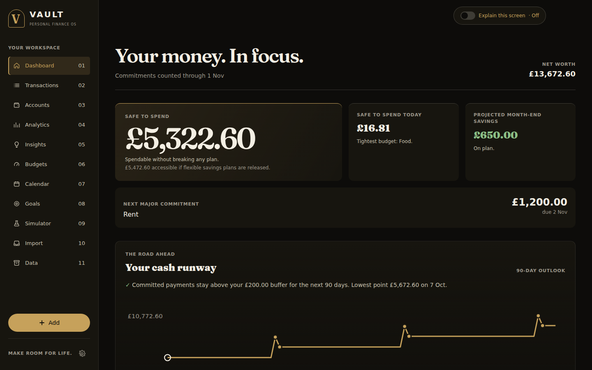
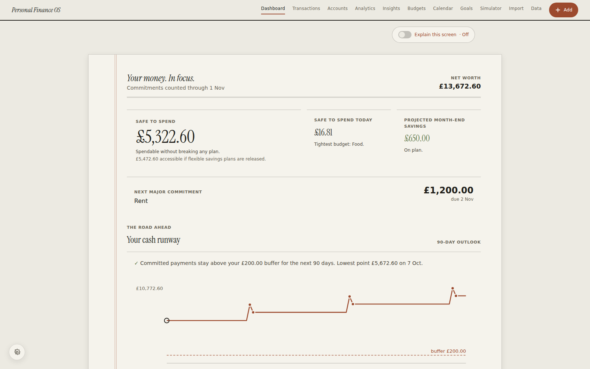
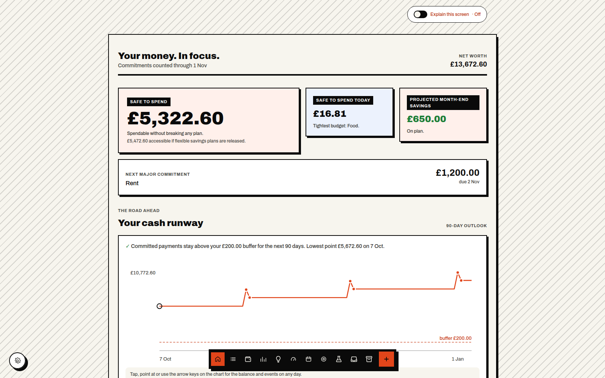
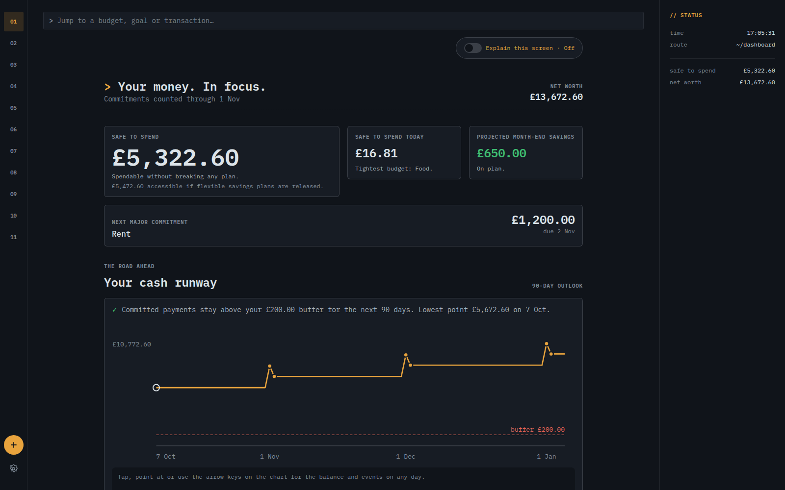
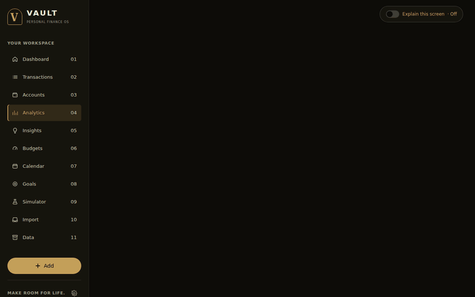
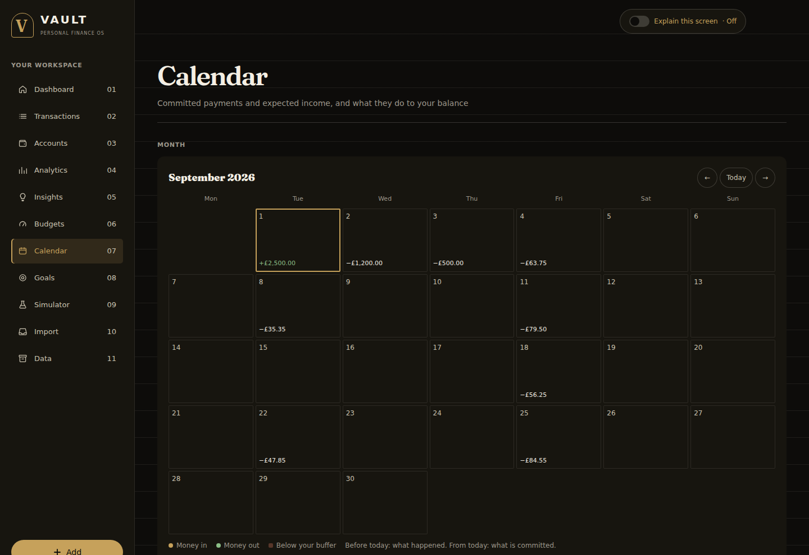
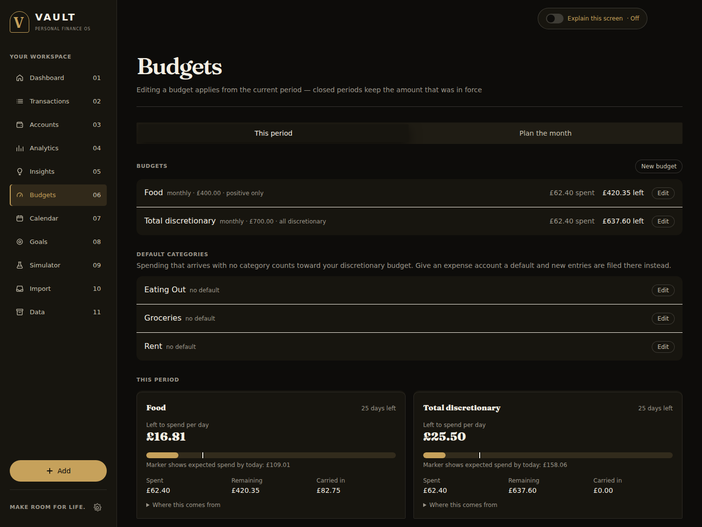
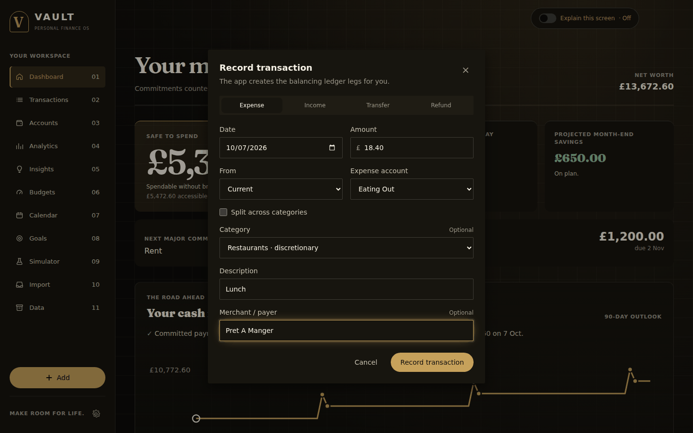

# Personal Finance OS

[](https://github.com/FuaadBashi/Budgeting-App/actions/workflows/ci.yml)

A ledger-first personal finance platform: track transactions, plan against budgets and goals, and
see what upcoming commitments do to your cash. Built from the *Personal Finance OS* project plan,
with the accounting model settled before anything else.



Three documents govern the code:

| | |
|---|---|
| **[docs/FINANCIAL_RULEBOOK.md](docs/FINANCIAL_RULEBOOK.md)** | The normative definitions. Where code and rulebook disagree, that is a defect report. |
| **[docs/DECISIONS.md](docs/DECISIONS.md)** | Product decisions taken, and what remains open. |
| **[docs/HANDOFF.md](docs/HANDOFF.md)** | State of play and everything left to do. **Start here.** |

`docs/BUDGET_ENGINE_SPEC.md` is the derived design spec for Phase 3, kept for its worked examples.

## Review guide

Start with [the financial rulebook](docs/FINANCIAL_RULEBOOK.md), follow a transaction through
[the API](backend/app/api) and [ledger models](backend/app/models/ledger.py), then inspect
[the invariant tests](backend/tests). [The running guide](docs/RUNNING.md) covers local operation.

## Current state

**Phases 0–9 and 11 complete; Phase 10 is backups-done, deploy-yours.** It replaces a
spreadsheet and then some: record transactions, manage balances, track budgets with rollover and
warnings, save toward goals, see upcoming cash flow against a protected buffer, import statements
and receipts through a candidate inbox, sync UK bank feeds into that same review flow, automate
categorisation with deterministic rules, split entries across categories, assign expected income
in a zero-based month plan, run what-if scenarios, and read an explanation of how every figure was
reached. 974 tests.

A frontend visual design system also ships four switchable directions (Vault Noir, Field
Ledger, Raw Ledger, Command Ledger), each with its own light and dark palette, picked from the
gear icon on every screen. See `docs/HANDOFF.md`'s Frontend section for where it lives and
`docs/DECISIONS.md` for why it's built the way it is.

Left to do: the deploy itself and the product decision about whether to retain four visual
directions or consolidate them. `docs/RUNNING.md` describes the deploy setup worth having —
Tailscale, real certificates, nothing exposed to the internet.

## Screenshots

All figures are the fictional household `scripts/seed_demo.py` creates.

**Four designs, one set of components.** Each is a token set in `globals.css` with its own light
and dark palette, switched from the gear icon.

| Vault Noir: quiet, dark, expensive | Field Ledger: a financial paper |
|---|---|
|  |  |
| **Raw Ledger: loud, hard-edged** | **Command Ledger: an engineered console** |
|  |  |

**Each design moves in its own way.** The same Analytics screen arriving in Vault Noir (rises out of
a blur), Field Ledger (inks in place), Raw Ledger (drops in hard, in steps) and Command Ledger
(repaints like a console). With reduced motion set, none of it plays.



**Every figure shows its working.** Nothing derived is stored, so Insights can show each headline
number as the sum it actually is.


| Analytics over six months | Calendar: what happened and what is committed |
|---|---|
|  |  |
| **Budgets with rollover and a daily allowance** | **Recording a transaction: the app writes the ledger legs** |
|  |  |

## Design in one paragraph

The ledger is **double-entry**. A transaction is a header carrying no amount; money lives in
signed `Posting` rows that must sum to zero — enforced by a deferred Postgres trigger, so the
invariant holds for any writer, not just this ORM. The transaction types from the plan
(`income`, `savings_transfer`, `debt_payment`…) are *derived* from which account kinds a
transaction touches, never stored. Money is `NUMERIC(19,4)` in the database, `Decimal` in Python
and integer pence across the API. Every displayed figure is computed from postings on read;
nothing derived is stored as editable data.

## Setup

Requires Python 3.12+, PostgreSQL 17 and Node 20+. Run each command block below from the repository root in a fresh terminal, or return there between blocks; `cd backend` and `cd frontend` are sibling paths.

```bash
brew services start postgresql@17
```

```bash
createdb budgetapp && createdb budgetapp_test
```

```bash
cd backend && python3 -m venv .venv && ./.venv/bin/pip install -e ".[dev]" && ./.venv/bin/alembic upgrade head
```

```bash
cd frontend && npm install
```

Optional demo data:

```bash
cd backend && ./.venv/bin/python scripts/seed_demo.py
```

## Running

API on :8000 —

```bash
cd backend && ./.venv/bin/uvicorn app.main:app --reload
```

Web on :3000 —

```bash
cd frontend && npm run dev
```

Interactive API docs are at **http://localhost:8000/docs**.

## Tests

```bash
cd backend && ./.venv/bin/python -m pytest -q
```

CI runs the same suite on every push against Postgres 17, and lints, tests and builds the
frontend.

The suite is organised around the rulebook's named invariants rather than around modules — `L1`
postings sum to zero, `N1` transfers preserve net worth, `S1` no double-counting of fulfilled
contributions, `O1` a paid obligation leaves the forecast, `D1` bucketing uses the reporting
timezone, and so on. Section 12 of the rulebook lists the full set.

## Layout

```
backend/
  app/
    models/      accounts, transactions, postings, budgets, goals, obligations
    domain/      clock, periods, categories, spend, budgets, projection,
                 budget_warnings, merchant_baseline, budget_recovery, recurrence,
                 obligations, income, reimbursement, impact, analytics, restore,
                 calendar, classification, disposable, money, simulation,
                 importing, receipts, enrichment, explain, insights, backup,
                 rules, plan, bank_sync
    api/         routes and the minor-unit boundary
  alembic/       migrations, including the L1 balance and L3 correction triggers
  scripts/       seed_demo.py, backup.py, set_password.py, backfill_categories.py
  tests/unit/    one module per invariant group
frontend/
  src/lib/       API client, minor-unit money formatting
  src/components/ app shell, split transaction entry, rules, bank connections,
                  month plan, stat tiles, budget cards, calendar and charts
  src/app/       eleven screens: dashboard, transactions, accounts, analytics, insights,
                 budgets, calendar, goals, simulator, import, data
docs/
```

## Security

Single-user. Authentication is **off by default** — the app is local-first, and a login on
`localhost` is friction with no threat model behind it. The API logs a warning at startup while
unprotected.

To turn it on:

```bash
cd backend && ./.venv/bin/python scripts/set_password.py
```

It prompts for a password, hashes it, and writes the hash straight into `backend/.env`
(gitignored). The hash is never printed, so there is nothing to copy. A `SESSION_SECRET` is
generated alongside it on first run. Restart the API afterwards; changing the password ends every
existing session.

Sessions are signed with the secret rather than the hash, so the hash can only verify a password
and never mint a session.

Behind a reverse proxy terminating HTTPS, also set `COOKIE_SECURE=true`.
